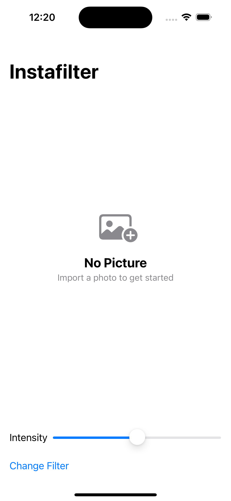
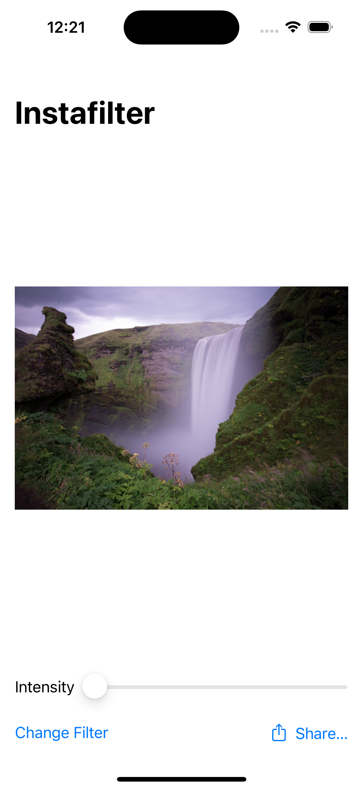
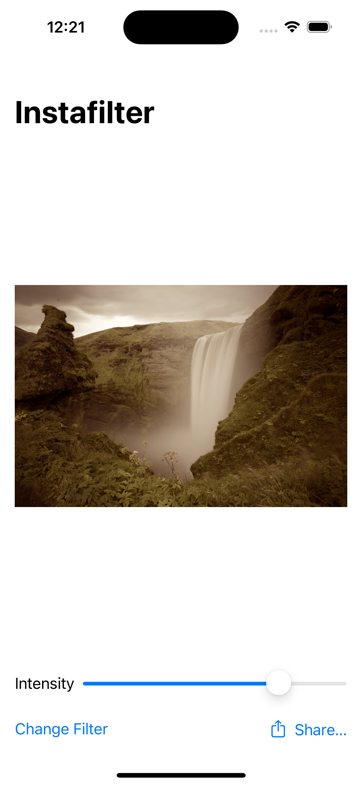

# Instafilter

Instafilter is an engaging iOS application developed using SwiftUI, designed to allow users to apply various filters to their photos. With a clean and intuitive interface, Instafilter provides a seamless experience for users looking to enhance their images with different effects directly from their iOS devices.

    
    
    

## Features

- **Photo Editing**: Allows users to import photos and apply different filters to enhance their visual appeal.
- **Customizable Intensity**: Users can adjust the intensity of each filter to achieve their desired effect.
- **Multiple Filter Options**: Provides a variety of filters such as Crystallize, Gaussian Blur, Sepia Tone, and more.
- **Share Functionality**: Enables users to share their edited images directly from the app.

## How to Use

1. Open the app to start editing a photo.
2. Use the PhotosPicker to import a photo you wish to edit.
3. Adjust the filter intensity using the slider for a custom effect.
4. Tap the "Change Filter" button to choose a different filter.
5. Share your edited photo using the ShareLink feature.

## Technologies Used

- **SwiftUI**: Utilized for building the user interface, ensuring a modern and responsive user experience.
- **Core Image**: Used for handling image processing tasks with various filters.
- **Swift**: The programming language used for developing the app's logic.
- **Xcode**: The IDE used for iOS app development, aiding in the creation and testing of Instafilter.

## Getting Started

To run this project locally, you'll need:

- Xcode installed on your Mac.
- Clone this repository to your local machine.
- Open the project in Xcode.
- Build and run the project on a simulator or your iOS device.

## Credits

This project is part of the ["100 Days of SwiftUI"](https://www.hackingwithswift.com/100/swiftui) course by Paul Hudson. I learned how to build this project and further develop my SwiftUI skills through the course.

## Learning Experience

This project provided a hands-on experience with SwiftUI and Core Image, deepening my understanding of image processing and user interface design in iOS applications.
